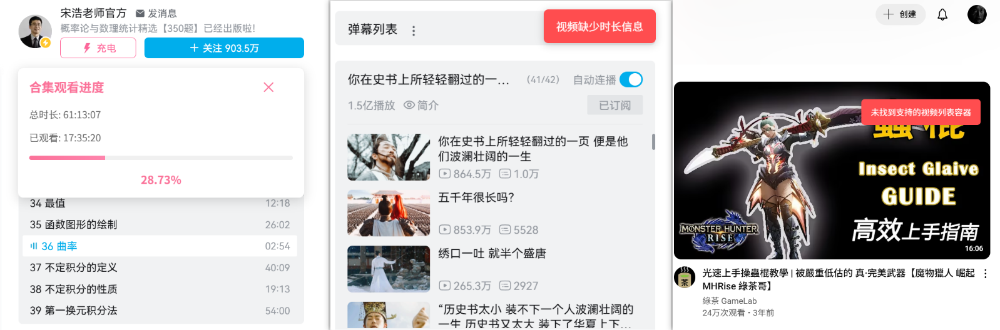
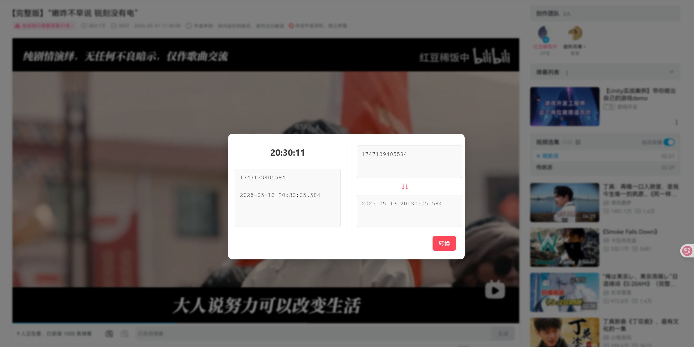
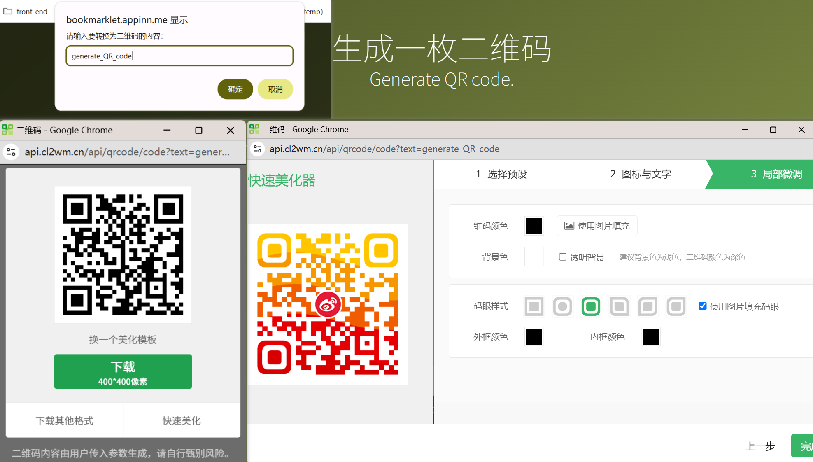
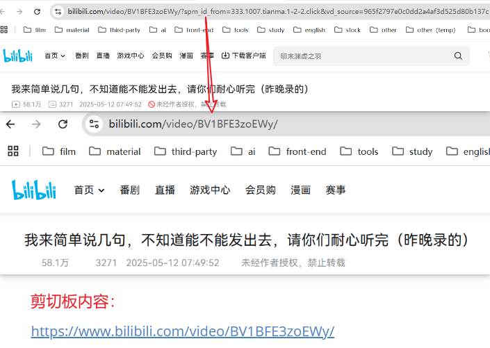
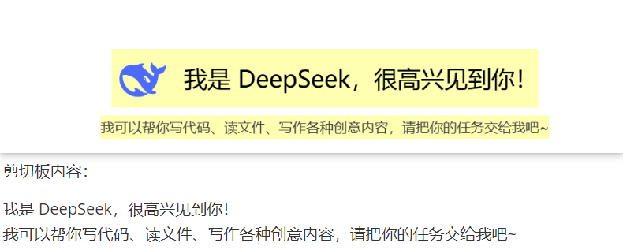

# bookmarklets

常用浏览器书签工具

### 使用方式

浏览器标签栏鼠标右键 —> 添加网页 —> 将所选的 js 代码全选复制到“网址” —> 保存

### 书签列表

#### 1、bilibili_progress bilibili	获取视频观看进度

列表项无时长展示的视频无法读取

#### 2、time_tools	时间工具。实时展示时间，时间戳-日期互相转换（点击箭头方向切换）

### 其他开源收集优化

#### 1、generate_QR_code	生成一枚自定义二维码（by 小老鼠：https://bookmarklet.appinn.me/）

优化：窗口样式

#### 2、web_page_auto_scrolling	网页自动滚动（by 小老鼠）

点书签开始滚动，点网页空白处切换滚动状态（开始/停止），双击网页空白返回顶部（x）

优化：滑动鼠标滚轮清除滚动、双击网页返回“点击标签时”的页面高度（√）

#### 3、link_cleaner	缩短网址链接并复制（by 小老鼠）

优化：复制优先使用navigator.clipboard

#### 4、paragraph_check & copy	段落高亮+复制高亮（by 小老鼠）

优化：复制优先使用navigator.clipboard、通知样式

